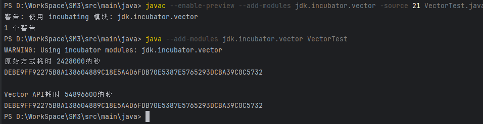

关于Vector API的使用见[VectorAPI的介绍&简单使用](Vector%20API介绍、简单使用.md)

具体思路分析见 [VectorAPI优化SM3算法思路](Vector%20API优化SM3算法.md)

## 前置条件

java版本为GraalVM23.1.3 - Java21.0.3

---

## 执行流程
由于不知道该怎么在IDEA中编译执行包含孵化期API的代码，故只能在命令行中执行。JMH测试程序在命令行中无法运行。

在src\main\java目录下依次执行：
- javac --enable-preview --add-modules jdk.incubator.vector -source 21 VectorTest.java 
- java --add-modules jdk.incubator.vector VectorTest

--- 
## 运行截图如下：

